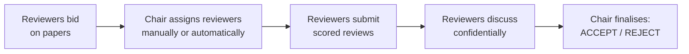

# EasyConf — Reviews Microservice

A Spring Boot microservice that manages the full peer-review lifecycle of conference papers — bidding, reviewer assignment, review submission, discussion and the final accept/reject decision — built with a domain-driven design and a heavily tested application core.

[](https://github.com/RSerban2003/ReviewsMicroservice/actions/workflows/ci.yml)


[](LICENSE)

## What it does

EasyConf is a conference management system split into three microservices: **Users** (conferences, tracks, roles), **Submissions** (papers and authors) and **Reviews** (this repository). The Reviews service owns everything that happens to a paper between submission and decision:



Phases are **derived, not stored**: a track moves `SUBMITTING → BIDDING → ASSIGNING → REVIEWING → FINAL` based on deadlines and data, and each paper moves `BEFORE_REVIEW → IN_REVIEW → IN_DISCUSSION → REVIEWED` as reviews arrive. Every endpoint authenticates a `requesterID` against the caller's role in the track (chair / reviewer / author) and the current phase. See [docs/architecture.md](docs/architecture.md) for the DDD structure (aggregates, layers, verification chain, strategy pattern).

## Tech stack

| Concern | Choice |
|---|---|
| Language / runtime | Java 17 (Gradle toolchain) |
| Framework | Spring Boot 2.7.18, Spring Data JPA (Hibernate) |
| Database | H2 in-memory (schema recreated on start) |
| API docs | springdoc-openapi + Swagger UI; spec in [docs/api/openapi.yaml](docs/api/openapi.yaml) |
| Client codegen | openapi-generator (DTOs for the sibling microservices) |
| Testing | JUnit 5, Mockito, AssertJ, MockMvc, JaCoCo, PIT mutation testing |
| Static analysis | Checkstyle + PMD, zero-warning budget, enforced in CI |
| Build / CI | Gradle 8.14, GitHub Actions |

> The service deliberately stays on Spring Boot 2.7.18 (the last 2.x release): upgrading to Boot 3 requires the `javax.*` → `jakarta.*` namespace migration, springdoc 2.x and Hibernate 6 across the whole codebase, which is out of scope for this modernization pass. The upgrade path is isolated and documented; everything else (JDK 17, Gradle 8, tooling) is current.

## Quickstart

Requires JDK 17 (or Docker, see below). The `demo` profile stubs the two sibling microservices in memory and seeds a demo track with two papers, so the service runs fully standalone.

```bash
# Unix
git clone https://github.com/RSerban2003/ReviewsMicroservice.git
cd ReviewsMicroservice
./gradlew bootRun --args="--spring.profiles.active=demo"
```

```powershell
# Windows
git clone https://github.com/RSerban2003/ReviewsMicroservice.git
cd ReviewsMicroservice
.\gradlew.bat bootRun --args="--spring.profiles.active=demo"
```

Then hit an endpoint:

```bash
curl "http://localhost:8080/conferences/1/tracks/1/phase?requesterID=1"
# "BIDDING"
```

Or with Docker (defaults to the demo profile):

```bash
docker build -t reviews-microservice .
docker run -p 8080:8080 reviews-microservice
```

To run against real Users/Submissions services (expected on `localhost:8082` / `localhost:8081`), start without the demo profile: `./gradlew bootRun`.

## API documentation

- **Swagger UI** (live, generated from code): <http://localhost:8080/swagger-ui.html> while the service is running
- **ReDoc** (static): [docs/index.html](docs/index.html) renders [docs/api/openapi.yaml](docs/api/openapi.yaml) — servable via GitHub Pages
- **Guided walkthrough**: [docs/demo.http](docs/demo.http) drives the complete lifecycle — bid → assign → review → discuss → verdict — against the demo profile, with one request per step

The demo cast: user 1 is the PC chair, users 2–4 are reviewers, user 5 authored both seeded papers.

## Testing

```bash
./gradlew test                 # full suite
./gradlew build                # tests + Checkstyle + PMD
./gradlew jacocoTestReport     # coverage -> reviews-microservice/build/reports/jacoco
./gradlew pitest               # mutation testing -> build/reports/pitest
```

The suite contains **370 tests** across four levels: unit (services, verification, phase calculators), integration (controllers via MockMvc), repository (`@DataJpaTest`) and system tests (24 tests that need the real sibling microservices running and abort as *skipped* otherwise). JaCoCo reports **99% instruction / 100% branch coverage** over the hand-written production code (generated DTOs and configuration are excluded from the measurement, as configured in `build.gradle`).

## Attribution

This service originated as a five-person team project for the Software Engineering Methods course at TU Delft (2023–2024), where it was developed against the OpenAPI contracts of two sibling teams' microservices and integrated with them. This repository is my maintained and modernized version of that project: updated toolchain (JDK 17, Gradle 8, Spring Boot 2.7), GitHub Actions CI, a standalone demo mode, and rewritten documentation. The original requirements document is preserved in [docs/requirements.pdf](docs/requirements.pdf).

## License

[MIT](LICENSE)
