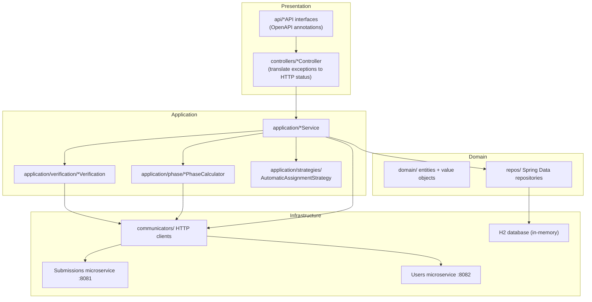
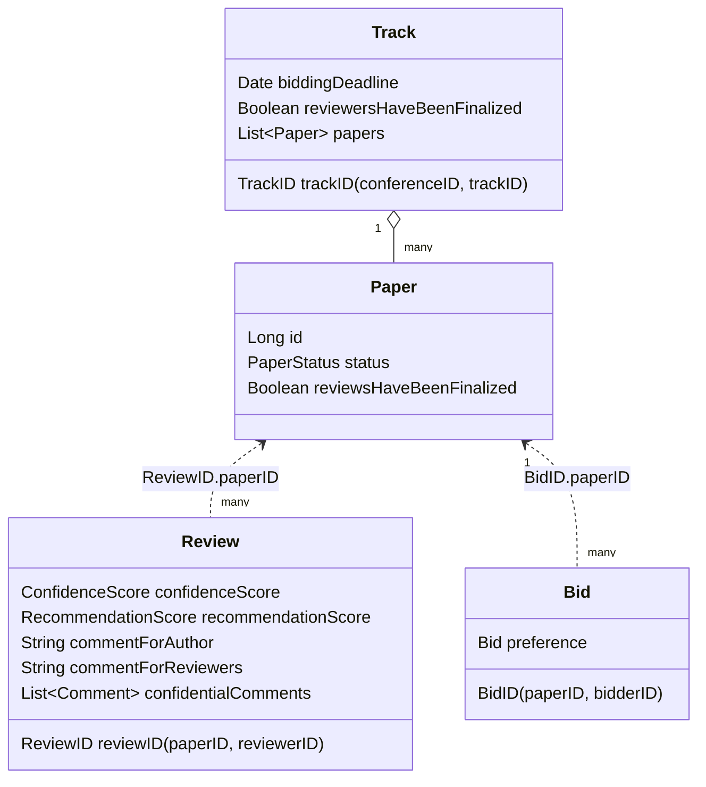
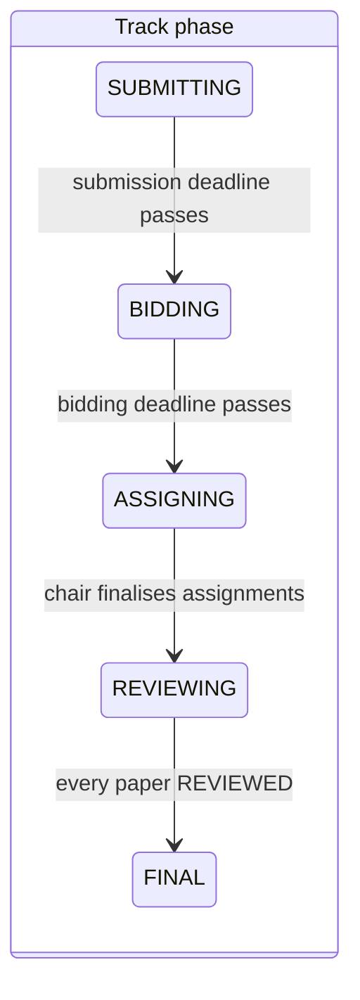
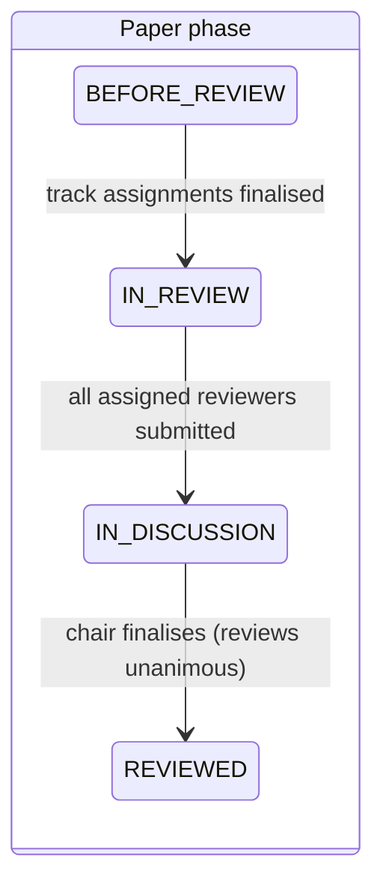

# Architecture

This document describes the structure of the Reviews microservice as it is implemented in
`reviews-microservice/src/main/java/nl/tudelft/sem/v20232024/team08b`.

## Context

The Reviews microservice is one of three services in **EasyConf**, a conference management
system. It owns the peer-review lifecycle of submitted papers; the two sibling services own
everything else:

| Service | Responsibility | Default address |
|---|---|---|
| **Reviews** (this repository) | Bidding, reviewer assignment, reviews, discussion, accept/reject decision | `localhost:8080` |
| Submissions | Paper submission, authors, conflicts of interest | `localhost:8081` |
| Users | Conferences, tracks, users and their roles, submission deadlines | `localhost:8082` |

There is no shared database: every fact the Reviews service needs about papers, users or
deadlines is fetched over HTTP at request time through the *communicators* layer. Requests
are authorised by passing a `requesterID` query parameter, which is checked against the
roles reported by the Users service.

## Layered structure

- **`api/`** — interfaces (`PapersAPI`, `ReviewsAPI`, `BidsAPI`, `AssignmentsAPI`, `TracksAPI`)
  that carry all springdoc/OpenAPI annotations (`@Tag`, `@Operation`, `@ApiResponses`).
  The checked-in spec in [`docs/api/openapi.yaml`](api/openapi.yaml) was generated from these.
- **`controllers/`** — one implementation per API interface. Controllers contain no business
  logic; they delegate to an application service and map domain exceptions to HTTP status
  codes (`NotFoundException` → 404, `IllegalAccessException`/`ForbiddenAccessException` → 403,
  `IllegalArgumentException` → 400, ...).
- **`application/`** — the services that implement use cases, plus three sub-packages:
  - `verification/` — authorisation and precondition checks, separated from business logic.
    `UsersVerification` resolves roles via the Users service; `PapersVerification`,
    `TracksVerification`, `BidsVerification`, `AssignmentsVerification` and
    `DiscussionVerification` combine role, existence, conflict-of-interest and phase checks.
  - `phase/` — `TrackPhaseCalculator` and `PaperPhaseCalculator` derive the current phase
    on demand (phases are computed, never stored, so they cannot get out of sync).
  - `strategies/` — `AutomaticAssignmentStrategy` (strategy pattern) with the default
    implementation `AssignmentWithThreeSmallest`, which assigns each paper to the three
    bidding reviewers with the smallest current workload.
- **`domain/`** — JPA entities and value objects (see below).
- **`repos/`** — Spring Data JPA repositories (`PaperRepository`, `ReviewRepository`,
  `BidRepository`, `TrackRepository`).
- **`communicators/`** — `CommunicationWithUsersMicroservice` and
  `CommunicationWithSubmissionMicroservice` interfaces with HTTP implementations built on
  `utils/HttpRequestSender` (Java 11+ `HttpClient`). Because they are interfaces, tests mock
  them and the `demo` profile substitutes in-memory stubs.
- **`dtos/`** — request/response DTOs. `dtos/review` is hand-written; `dtos/submissions` and
  `dtos/users` are generated at build time by openapi-generator from the sibling services'
  specs (`src/main/resources/teamA.yaml`, `teamC.yaml`).

## Domain model

- **`Track`** (table `track_reviews`) — aggregate keyed by the composite `TrackID`
  (conference ID + track ID). It mirrors only what the Reviews service needs locally
  (bidding deadline, whether assignments are final) and is lazily inserted the first time a
  track is touched (`TracksVerification.insertTrack`). The authoritative track lives in the
  Users service.
- **`Paper`** — local review state of a submission: `PaperStatus`
  (`ACCEPTED` / `REJECTED` / `NOT_DECIDED`) and a finalisation flag. Title, abstract and
  authors are never stored here — they are fetched from the Submissions service.
- **`Review`** — keyed by the composite `ReviewID` (paper + reviewer). An *empty* review row
  (no scores yet) represents an **assignment**; submitting fills in the scores. Discussion
  comments (`Comment` is an `@Embeddable` of author + text) attach to a review.
- **`Bid`** — a reviewer's stated preference for a paper
  (`CAN_REVIEW` / `NEUTRAL` / `NOT_REVIEW`).
- Value objects: `ConfidenceScore` (`BASIC` / `KNOWLEDGEABLE` / `EXPERT`),
  `RecommendationScore` (`STRONG_REJECT` / `WEAK_REJECT` / `WEAK_ACCEPT` / `STRONG_ACCEPT`).

## Phases as derived state

Both state machines are *calculated* from data, never persisted:

`TrackPhaseCalculator.getTrackPhase` compares the current time against the submission
deadline (fetched from the Users service) and the locally stored bidding deadline, then
inspects `Track.reviewersHaveBeenFinalized` and the phases of all papers.
`PaperPhaseCalculator.getPaperPhase` checks assignment finalisation, whether every assigned
reviewer has submitted (a review with a non-null `confidenceScore` counts as submitted), and
`Paper.reviewsHaveBeenFinalized`. The calculators take an injectable `Clock`, which the unit
tests fix to simulate deadlines.

## The review lifecycle

1. **Bidding** — after the submission deadline, reviewers `PUT /papers/{id}/bids` their
   preference. The default bidding window is the submission deadline + 2 days; a chair can
   move it (`PUT .../bidding-deadline`).
2. **Assignment** — during `ASSIGNING`, a chair assigns reviewers manually
   (`POST /papers/{id}/assignees/{reviewerID}`, conflict-of-interest checked against the
   Submissions service) or automatically (`PUT .../automatic`, using
   `AssignmentWithThreeSmallest` over the bids). Finalising
   (`POST .../finalization`) requires at least three reviewers per paper and flips the track
   into `REVIEWING`.
3. **Review** — each assigned reviewer `PUT`s a review (recommendation + confidence +
   comments). When the last one arrives, the paper enters `IN_DISCUSSION` automatically.
4. **Discussion** — reviewers see each other's reviews and attach confidential comments
   (`POST .../discussion-comments`). Reviewers may resubmit (edit) their reviews.
5. **Decision** — once the reviews are unanimous (all accept or all reject), the chair
   finalises the paper (`POST /papers/{id}/reviews/finalization`), which sets
   `PaperStatus` to `ACCEPTED`/`REJECTED` and freezes the reviews. When every paper is
   decided the track reaches `FINAL` and authors may read their reviews.

## Authorisation

Every endpoint receives the caller as `requesterID`. `UsersVerification` resolves the
caller's role in the relevant track via the Users service (`UserRole`: `CHAIR`, `REVIEWER`,
`AUTHOR`), and the verification classes enforce per-endpoint rules — e.g. only the track's
chair can assign reviewers or finalise; only an assigned reviewer can submit a review for
that paper; an author can see the paper status only after reviews are finalised. There is no
session or token authentication: the service was designed to sit behind the conference
system's gateway, trusting the forwarded user ID (a deliberate scope decision of the
original course project).

## Testing strategy

- **Unit tests** (`test/.../unit`) — services, verification classes and phase calculators
  with Mockito-mocked repositories and communicators.
- **Integration tests** (`test/.../integration`) — controllers through `MockMvc`, asserting
  HTTP status mapping and JSON contracts.
- **Repository tests** (`test/.../database`) — `@DataJpaTest` against in-memory H2.
- **System tests** (`test/.../system`) — full end-to-end flows that require the real Users
  and Submissions services on ports 8082/8081; they abort (show as *skipped*) when those are
  not running.

JaCoCo enforces reporting over the hand-written code (generated DTO packages and config are
excluded); PIT mutation testing is configured (`./gradlew pitest`). Checkstyle and PMD run
as part of `./gradlew check` with zero-warning budgets.
